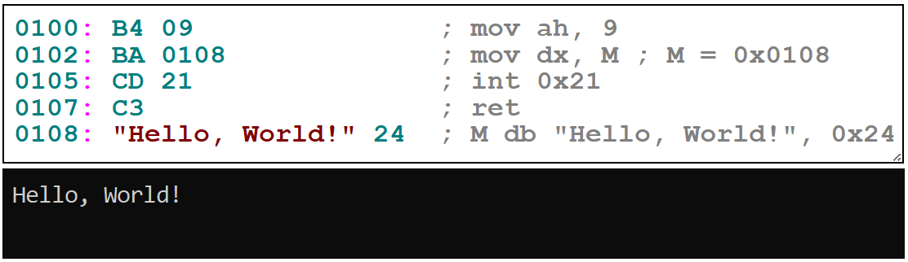
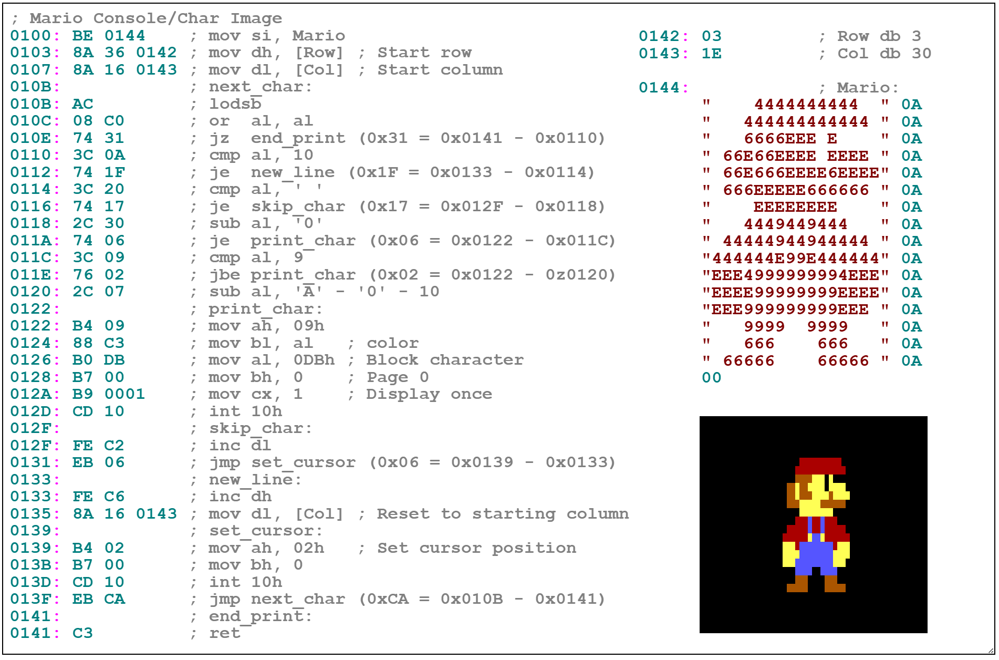

<h1>Machine Language</h1>

<b>Machine Language</b> is the byte-level (or bit-level) representation of data and executable instructions, targeting real hardware processors, virtual machines or data structures and formats. Machine language allows the direct description of the binary organization of information in computing systems, as instructions or data structures, in the form of binary sequences that can be directly loaded into memory for efficient exploration and execution by the system.

The next example related to the x86 processor family represents the simplest, complete and most compact possible code of a "Hello, World!" application written in machine language. <https://www.preprints.org/manuscript/202601.2364>

On the left is the machine language which represents descriptions of machine instructions as numerical values ​​distributed over a string of bytes prefixed at the beginning of the line by a label indicating their address/location. The descriptions are implicitly in base 16, big-endian for multibyte descriptions like 0108 (which is equivalent to the little-endian description 08 01), but also in other bases like 256/Ascii (in the case of the string "Hello, World!"), etc. On the right side (in the comments) are the equivalent descriptions in assembly language, the links between the two languages ​​being obvious. The executable application contains the 22 bytes described in the code and displays (when it run) the message "Hello, World!" shown at the bottom side. Similarly, in the case of the following example of an application described in machine language that displays the console (character) image of Mario.

